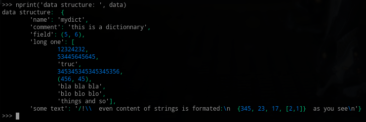

nprint
------

This is a module providing convenient functions to format, color and print any string to highlight any contained data structures.

It intends to replace the well known `pprint`, to format python objects on output

```python
from nprint import nprint

data = {
	'name': 'mydict',
	'comment': 'this is a dictionnary',
	'field': (5, 6),
	'long one': [12324232, 53445645645, 'truc', 345345345345345356, (456,45), 'bla bla bla', 'blo blo blo', 'things and so'],
	'some text': '/!\\  even content of strings are formated:\n  {345, 23, 17, [2,1]}  as you see\n',
	}
```




### functions provided:

+ `nprint(*args, indent=0, color=True, end='\n')`

	the pprint replacement: it works as `print()` but works on strings instead of working on already known objects 
	
	it splits too long lines into indented blocks by syntax markers  (such as `{}()[]`, etc)
	
	be careful:  as print(), nprint use the string conversion str(obj) to convert an object passed, if you want to use the string representation, then you'll have to pass repr(obj) to nprint or nformat

+ `nformat(text, indent=0, width=100) -> str`     

	split a text into indented lines

+ `ncolor(text) -> str`

	add color makers for terminals syntax highlighting

+ `deformat(text) -> str`

	remove formatting of all marker-enclosed text
	
